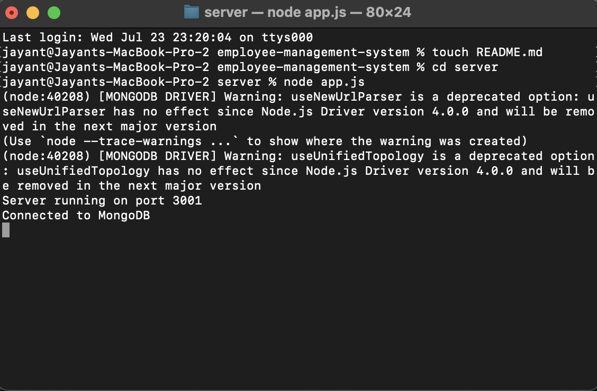
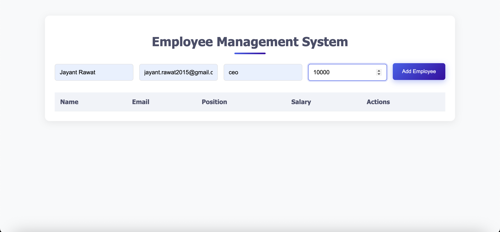
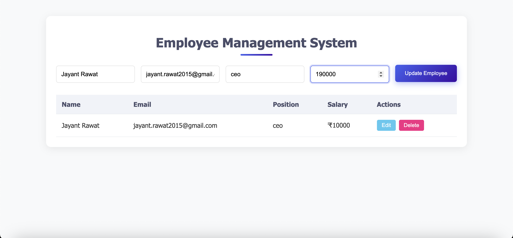
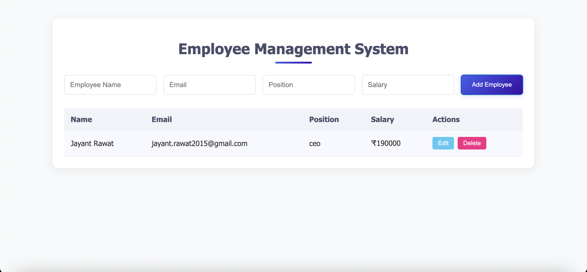
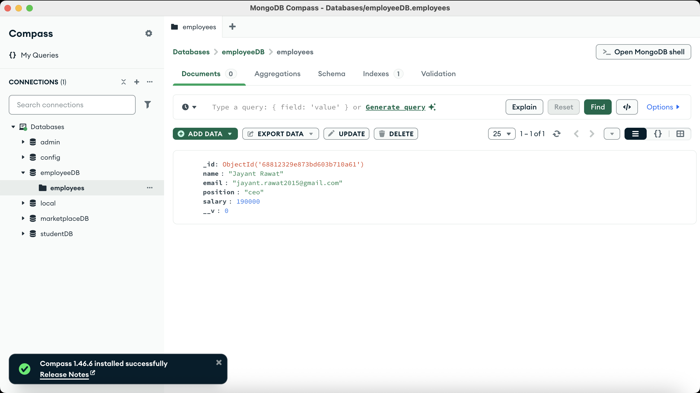

# Employee Management System - Setup and Installation Guide

## Project Overview
This is a simple Employee Management System built with HTML, CSS, JavaScript, and MongoDB. It allows you to:
- Add new employees
- View all employees
- Edit existing employee details
- Delete employees

## Prerequisites
Before you begin, ensure you have the following installed:
- Node.js (v14 or higher)
- MongoDB (running locally or connection string for remote DB)
- Git (for cloning the repository)

## Step 1: Clone the Project
Open your command line or terminal and navigate to your preferred directory.

Clone the project repository:
```bash
git clone <repository_url> employee-management-system
cd employee-management-system
```

## Step 2: Set Up the Backend
1. Navigate to the server directory:
```bash
cd server
```

2. Install dependencies:
```bash
npm install
```

3. Start the MongoDB service (ensure it's running on your system)

4. Start the backend server:
```bash
node app.js
```
The server should now be running on `http://localhost:3001`

## Step 3: Set Up the Frontend
1. Open a new terminal window/tab and navigate to the client directory:
```bash
cd client
```

2. Open the `index.html` file in your browser:
    - You can either double-click the file
    - Or use a local server like Live Server extension in VSCode

## Step 4: Using the Application
1. The application will automatically load in your browser
2. Use the form to add new employees
3. Existing employees will be displayed in the table
4. Use the Edit/Delete buttons to manage employees

## Admin Features
- All data is stored in MongoDB
- The API endpoints are:
    - GET `/api/employees` - Get all employees
    - POST `/api/employees` - Add new employee
    - PUT `/api/employees/:id` - Update employee
    - DELETE `/api/employees/:id` - Delete employee

## Video Demonstration
[](https://youtu.be/cYTcejDDKMs)

## Screenshots

### 1. Terminal — Starting the Backend Server
Shows the terminal with `node app.js` running successfully.



---

### 2. Adding a New Employee
Form used to add a new employee.



---

### 3. Editing Employee Details
Update employee name, email, or role.





---

### 4. MongoDB Compass View
Visual of the `employeeDB` database and `employees` collection in MongoDB Compass.



## Future Enhancements
1. Add employee search functionality
2. Implement pagination for large employee lists
3. Add user authentication
4. Include employee photo uploads
5. Add department management

## Contact Information
For any issues or questions, please contact:
Jayant
jayant.rawat2015@gmail.com
